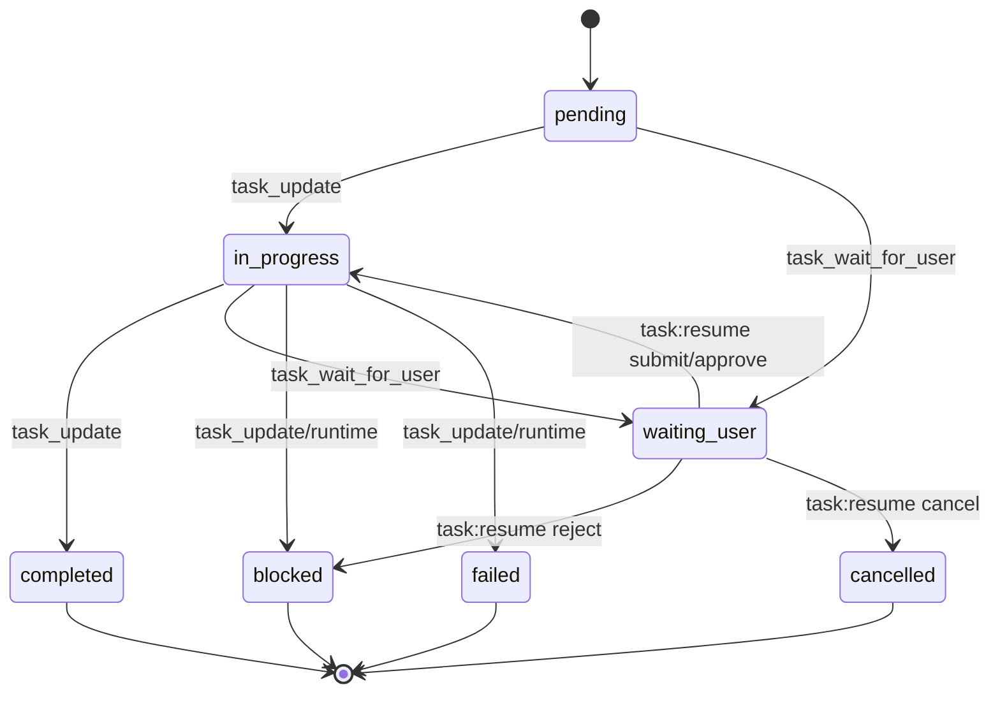

# Task 工具等待用户与续行设计

## 背景

当前 Task V2 会在模型停止但仍有 `pending` 或 `in_progress` 任务时注入系统续行提示，驱动模型继续执行。问题出现在模型已经向用户提问并等待回复时：如果任务链里仍有 `pending` 任务，续行提示会绕过等待状态，让模型继续往下走。

## 最终实现

本次实现将 P0 文本门禁升级为结构化 human-in-the-loop 中断/恢复链路：

- Task 状态扩展为 `pending`、`in_progress`、`waiting_user`、`blocked`、`failed`、`completed`、`cancelled`。
- `waiting_user`、`blocked`、`failed`、`cancelled` 都会阻止自动续跑。
- `canAutoContinueTaskChain()` 成为唯一 Task V2 自动续跑门禁，同时检查用户等待、后台交接、Plan Mode 接管和续跑次数上限。
- 新增 session-scoped `TaskInterruptRequest`，包含 `requestId`、`taskId`、`reason`、`question`、`choices`、`inputSchema`、`resumeToken`、`schemaVersion` 和生命周期时间。
- 新增 `task_wait_for_user` 工具。模型调用后 runtime 创建 active interrupt、把任务置为 `waiting_user`，返回 `terminalForTurn: true`，并跳过 `[任务未完成]` 续行注入。
- 新增 `task:resume` IPC。UI 提交 `TaskResumeInput` 后，runtime 校验 `requestId`、`resumeToken`、request 状态和 task 状态，再把恢复上下文写入 session messages。
- `submit` / `approve` 将任务恢复为 `in_progress`；`reject` 将任务置为 `blocked`；`cancel` 将任务置为 `cancelled`。
- `PlanStatePanel` 渲染“需要你回复”卡片，展示问题、原因、选项和 `提交并继续`、`批准并继续`、`拒绝并停止`、`取消任务` 操作。

## 复查后补强

- `canAutoContinueTaskChain()` 同时检查 `session.taskInterrupts`，只要存在 active interrupt，即使任务被错误改回 `pending` / `in_progress`，也不允许自动续跑。
- `task_update` 不再暴露或接受 `waiting_user` 状态；模型如果需要等待用户，必须调用终止型 `task_wait_for_user`。
- tool loop 会优先识别同轮 `task_wait_for_user`。一旦出现该工具，本轮只执行该工具，其它已批准工具写入 skipped tool result，避免“先跑只读工具再暂停”的顺序漏洞。
- `task:resume` 的 submit / approve 路径复用 task-store 的 `in_progress` 语义，因此会校验 `blockedBy`，并自动把其它 `in_progress` 任务降回 `pending`。
- invalid action 不会被误当作 cancel；expired request 会先落库为 `expired`，目标任务置为 `blocked`，再把错误返回给 UI。
- `inputSchema`、`choices`、`expiresAt` 在 strict schema 下保持 nullable，兼容 OpenAI strict tool schema。
- UI 等待卡片支持简单字段表单、重复提交保护、多 waiting task 下选择真正 active interrupt，并在 active interrupt 存在时禁止本地 dismiss 隐藏恢复入口。

## 状态机

## 恢复流程

1. 模型遇到需要用户输入的 task，调用 `task_wait_for_user({ taskId, question, reason, choices?, inputSchema?, expiresAt? })`。
2. main 进程创建 `TaskInterruptRequest`，写入 `session.taskInterrupts`，并把目标 task metadata 标记为 `awaitingUser` 和 `interruptRequestId`。
3. tool loop 看到 `terminalForTurn: true` 后停止本轮，不继续执行后续工具，也不注入 `[任务未完成]`。
4. renderer 在任务面板显示 active interrupt 卡片，用户选择提交、批准、拒绝或取消。
5. preload 调用 `task:resume`，main 进程校验一次性 `resumeToken` 和 active 状态。
6. runtime 更新 task/request 状态，并追加 `{"type":"task_resume",...}` 系统消息，让模型下一轮能看到结构化恢复输入。
7. submit / approve 成功后，runtime 会写入 `task_resume` 系统消息，并在模型可用时触发内部续跑；内部续跑不会追加新的用户消息。
8. 下一轮只有恢复后的 `in_progress` task 可以继续推进，后续 `pending` task 仍受统一 gate 控制。

## 多模型兼容原则

- 状态机由 runtime 执行，模型只请求状态迁移。
- 工具 schema 使用小枚举和明确描述，避免嵌套 `oneOf` 或依赖 schema 默认值。
- `waiting_user` 的语义必须同时写入系统上下文、工具 schema 和 UI 文案。
- `task_wait_for_user` 是本轮终止型动作，调用后 runtime 直接暂停续行。
- 对弱 tool-calling 模型保留文本等待检测兜底，但兜底只负责阻止续跑，不替代结构化 interrupt。
- 禁止仅靠自然语言“请等待用户”作为唯一门禁。

## 验收条件

- 任意 active interrupt 或 `waiting_user` task 存在时，不会注入 `[任务未完成]`。
- `task_wait_for_user` 返回 JSON 字符串 envelope，包含 `status: "waiting_user"`、`interruptRequestId` 和 `terminalForTurn: true`。
- `task:resume` 只接受匹配的 active request 和 `resumeToken`。
- invalid token、expired request、resolved request 都不能恢复任务。
- invalid action 不会改变 request；过期 request 会持久化为 `expired`，对应 task 变为 `blocked`。
- `task_update(status: "waiting_user")` 会被拒绝，不能绕过 interrupt/token 链路。
- 同一轮出现 `task_wait_for_user` 与其它工具时，只执行等待工具，其它工具得到 skipped tool result。
- UI 等待卡片无运行 spinner，明确显示“需要你回复”。
- UI 能渲染 `inputSchema.fields`，提交 payload，并阻止重复点击。
- `approve` / `submit` 后任务回到 `in_progress`；`reject` / `cancel` 后任务不可自动续跑。
- typecheck、Task 相关 Vitest、UI 测试和乱码门禁必须通过。

## 参考模式

- LangGraph `interrupt` / `Command(resume=...)`：保存状态后暂停，再用显式 resume 输入继续。
- OpenAI Agents human review / approval：工具调用进入需要人工审查时暂停 run，批准或拒绝后恢复。
- Cloudflare Agents human-in-the-loop：pending approval、超时、审计日志和结构化 elicitation。
- Google ADK confirmations：用 `function_call_id` / `invocation_id` 绑定确认请求与恢复动作。
